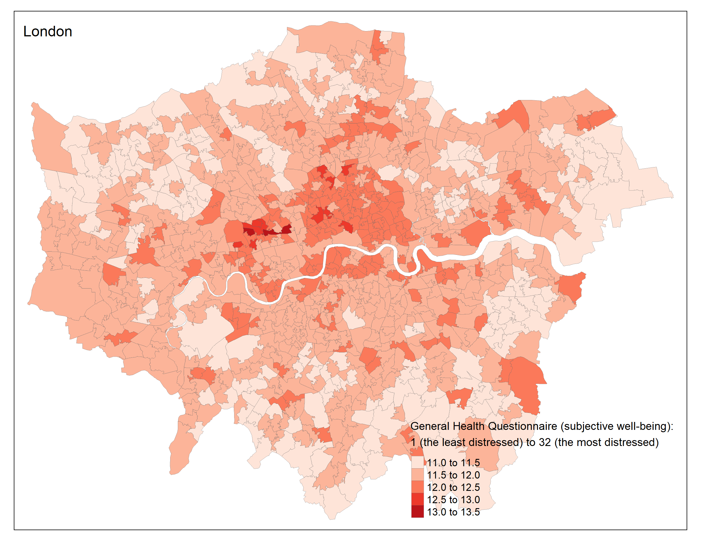
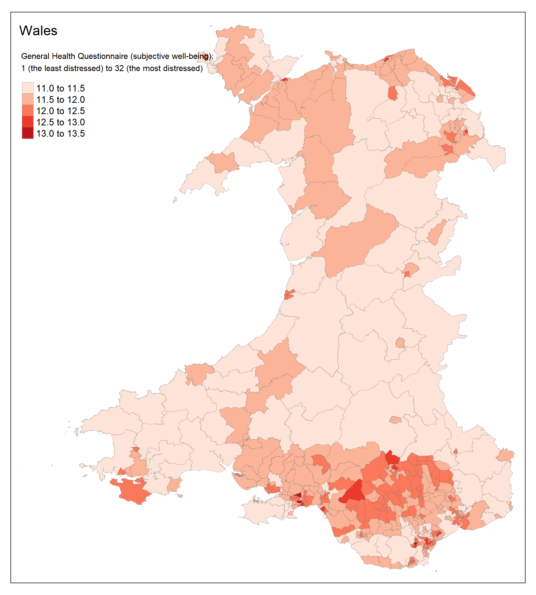

# Healthy and Happy Cities: Mental Health Modelling

This project is intended to:
- Understand the determinents of mental well-being during/following the COVID-19 times
- Create a UK synthetic population and use it to generate small area estimates of self-reported mental well-being 
- Produce a mental well-being dashboard that allows policy stakeholders to visualise and explore estimated mental health outcomes at a small area

Programming language: R

Example visualisations

