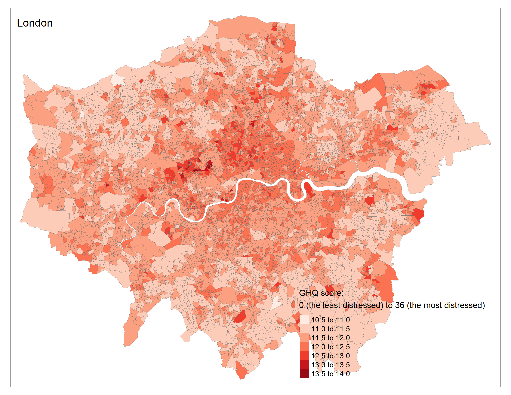
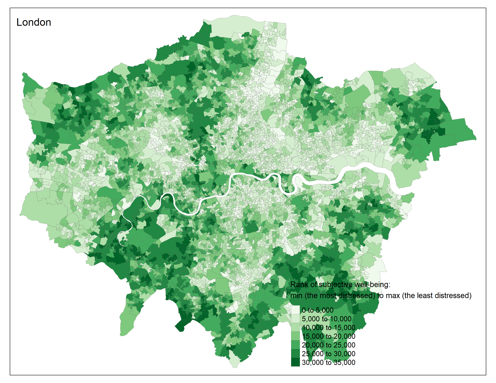
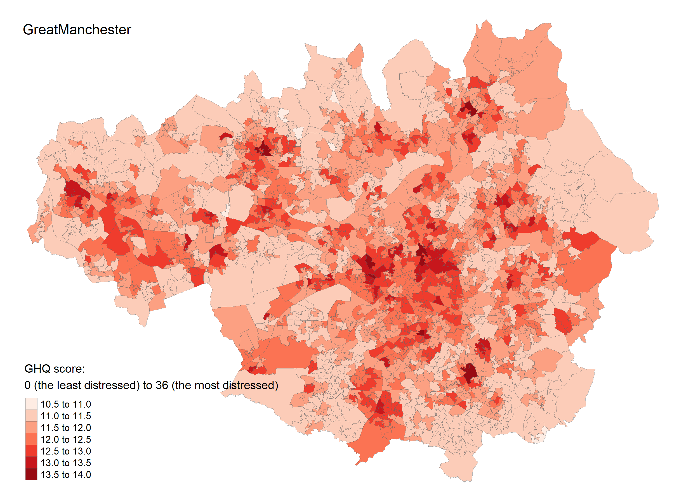
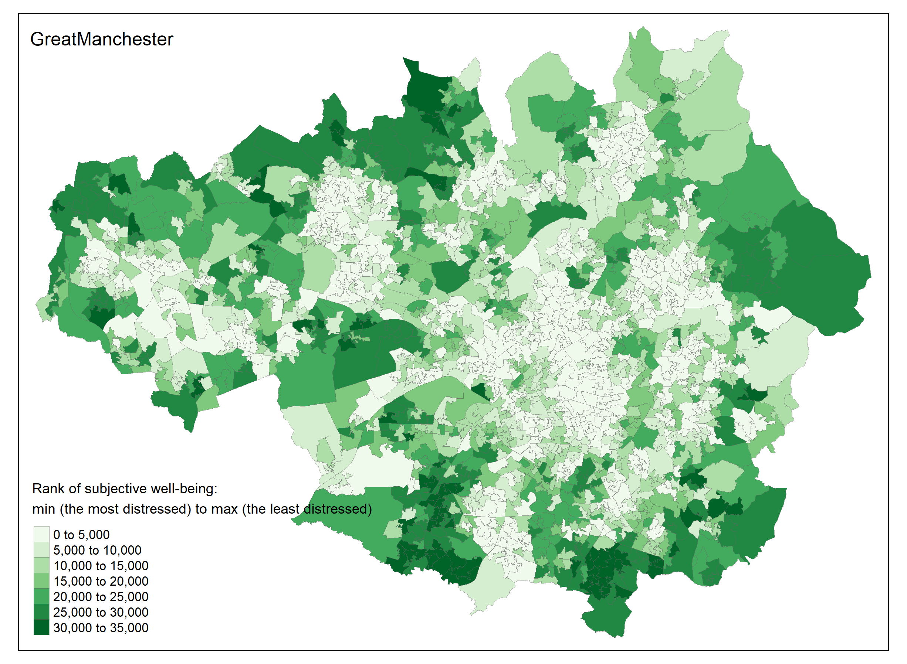
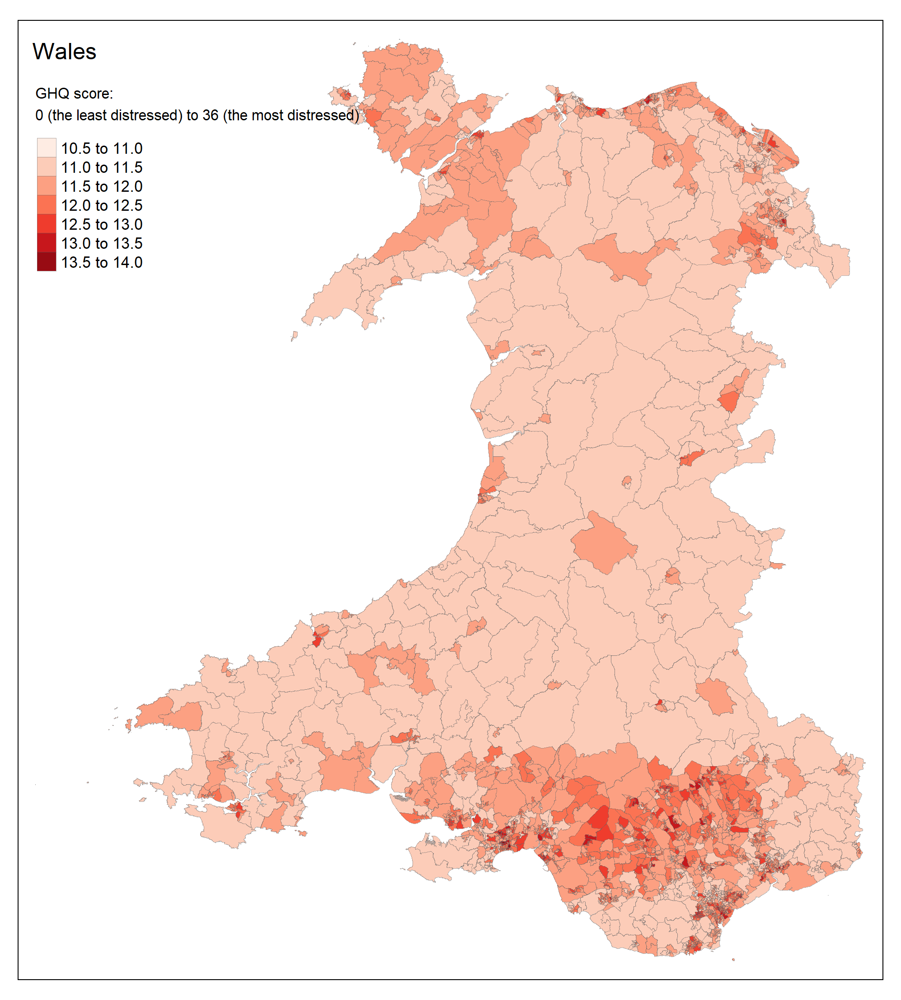
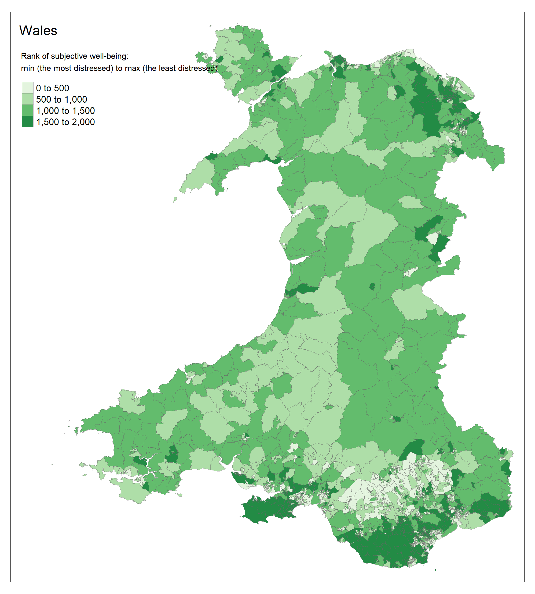

# Healthy and Happy Cities: Mental Well-being in the UK

This project is intended to:
- Understand the determinants of British people's mental well-being during/following COVID-19 times
- Create a UK synthetic population and use it to generate small-area estimates of self-reported mental well-being 

Programming language: R

GHQ = General Health Questionnaire

## Example visualisations
### GHQ scores in London by LSOA 
### Ranks of subjective well-being in London by LSOA 
### GHQ scores in Great Manchester by LSOA 
### Ranks of subjective well-being in Great Manchester by LSOA 
### GHQ scores in Wales by LSOA 
### Ranks of subjective well-being in Wales by LSOA 
